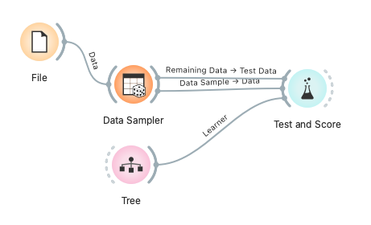
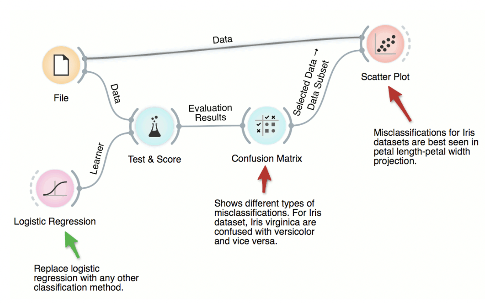
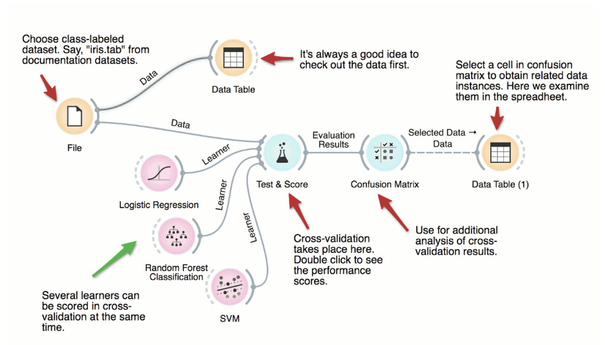

# Esercizi Orange

## Dataset

> Il formato nativo dei dati usati da Orange è indicato dall'estensione .tab. Un file di questo genere ha tre righe iniziali e poi una riga per ogni istanza. Ogni campo è delimitato dal carattere \t (tabulazione). La prima riga del file contiene il nome degli attributi; la seconda il tipo (continuos, discrete o string), e la terza (opzionale) contiene l'elemento (uno tra class, meta e time)

- `zoo.tab`: un dataset di 101 tuple rappresentati animali in uno zoo. Vi sono 16 feature rappresentanti i tratti di un animale. Le feature sono binarie. Vi sono 7 classi di animali: Mammal, Bird, Reptile, Fish, Amphibian, Insect e Invertebrate.
- `titanic.tab`: un dataset di 2000+ tuple rappresentate i passeggeri del Titanic. Vi sono 3 feature (status, age, sex). Le feature sono categoriche. Vi è una sola classe, che indica se il passeggero e sopravvissuto oppure no.
- `iris.tab`: un dataset di 150+ tuple rappresentanti dei fiori (iris). Vi sono 4 feature rappresentanti il tratto del fiore: lunghezza e larghezza del sepalo e del petalo. Le feature sono numeriche. Vi sono tre classi: Iris setosa, Iris virginica e Iris versicolor.
- `housing.tab`: chiamato anche Boston Housing dataset. È un dataset di 500+ tuple, dove ogni tupla rappresenta una specifica area dei sobborghi di Boston. Vi sono 14 feature (riportate di seguito). La classe è MEDV, che è un valore continuo. Questo dataset viene utilizzato per task di regressione.
    - CRIM: Per capita crime rate by town.
    - ZN: Proportion of residential land zoned for lots over 25,000 sq. ft.
    - INDUS: Proportion of non-retail business acres per town.
    - CHAS: Charles River dummy variable (1 if tract bounds river; 0 otherwise).
    - NOX: Nitrogen oxides concentration (parts per 10 million).
    - RM: Average number of rooms per dwelling.
    - AGE: Proportion of owner-occupied units built prior to 1940.
    - DIS: Weighted distances to five Boston employment centers.
    - RAD: Index of accessibility to radial highways.
    - TAX: Full-value property tax rate per $10,000.
    - PTRATIO: Pupil-teacher ratio by town.
    - B: 1000(Bk - 0.63)^2 where Bk is the proportion of Black people by town.
    - LSTAT: Percentage of lower status of the population.
    - MEDV: Median value of owner-occupied homes in $1000s.

## Esercizi

### (1) Classificazione con il dataset Iris

*Obiettivo*: Costruire un modello di classificazione utilizzando il dataset Iris per prevedere la specie di un fiore di Iris (Setosa, Versicolor o Virginica) basandosi su quattro caratteristiche: lunghezza del sepalo, larghezza del sepalo, lunghezza del petalo e larghezza del petalo.

*Compiti*:
- Caricare il dataset.
- Eseguire un'analisi esplorativa dei dati (EDA) per comprendere la distribuzione e la relazione tra le diverse caratteristiche.
- Addestrare un modello di classificazione (es, albero decisionale) per prevedere la specie di Iris.
- Utilizzare il modello per predire nuove tuple.
- EXTRA: valutare le prestazioni del modello utilizzando metriche appropriate (come accuratezza, matrice di confusione).
- EXTRA: Sperimentare con diversi classificatori e confrontarne le prestazioni.

### (2) Classificazione con il dataset Zoo

*Obiettivo*: Classificare gli animali in una delle categorie in base ai loro attributi utilizzando il dataset Zoo.

*Compiti*:
- Caricare il dataset.
- Eseguire un'analisi esplorativa dei dati (EDA) per comprendere la distribuzione e la relazione tra le diverse caratteristiche.
- Addestrare un modello di classificazione (es, albero decisionale) per categorizzare gli animali.
- Utilizzare il modello per predire nuove tuple.
- EXTRA: valutare le prestazioni del modello utilizzando metriche appropriate (come accuratezza, matrice di confusione).
- EXTRA: Sperimentare con diversi classificatori e confrontarne le prestazioni.

## Esempi visuali di workflow

Esempio di valutazione fase di train e di test:

Esempio di visualizzazione di classificazioni non corrette (_misclassification_):

Esempio di cross validation:

Una serie di esempi molto utili sono disponibili sul [sito ufficiale di Orange](https://orangedatamining.com/example).